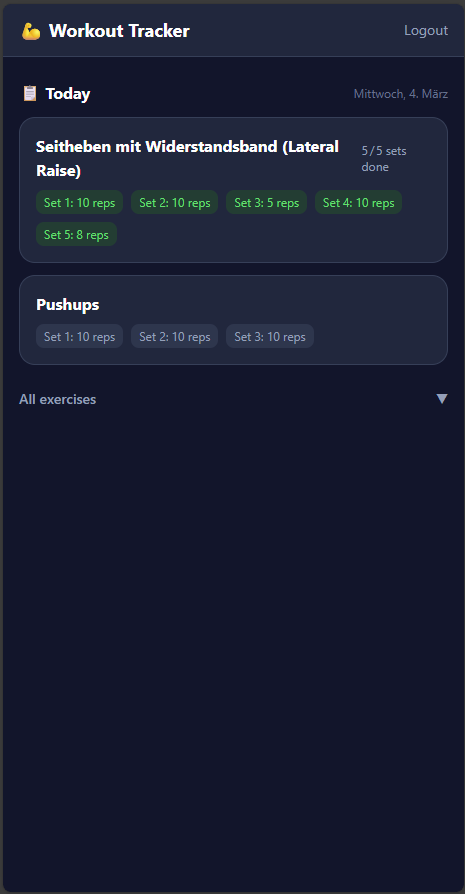
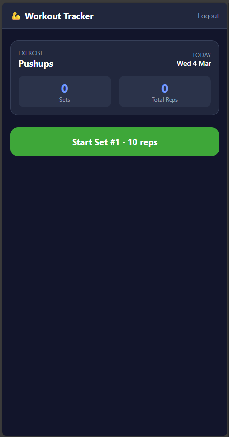
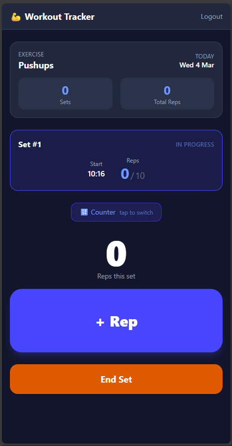
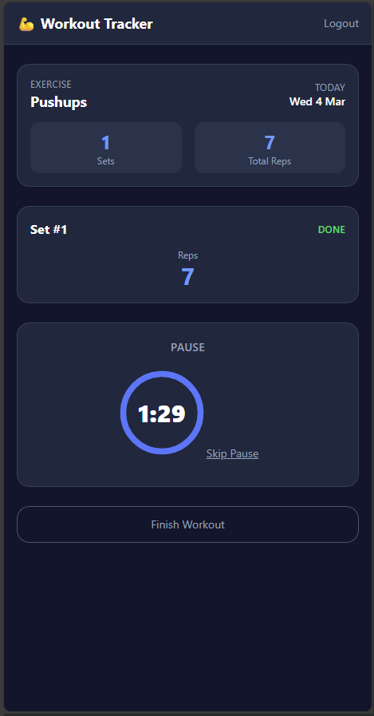
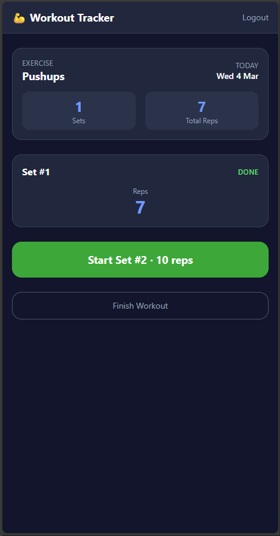
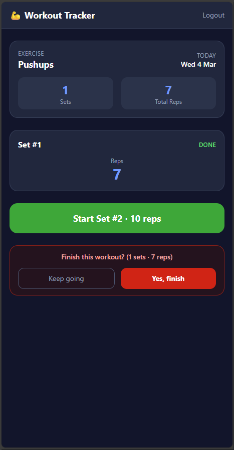
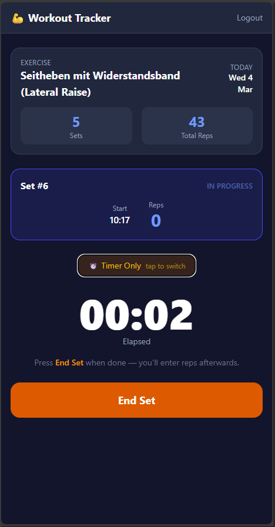
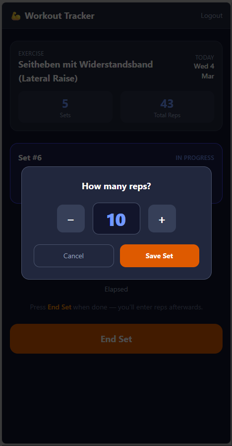

# 💪 Sparky Workout Tracker

[](https://github.com/sebmuc99/Sparky-Workout-Tracker/actions/workflows/docker-build.yml)
[](LICENSE)

A mobile-first **Progressive Web App (PWA)** for tracking gym workouts in real time — built as a companion app for [SparkyFitness](https://github.com/CodeWithCJ/SparkyFitness).

> **Requires a running SparkyFitness instance.** You need the server URL and an API key to log in.

---

## 📱 Features

- **Daily plan view** — shows today's exercises from your active SparkyFitness workout plan
- **Two tracking modes** — tap `+ Rep` per rep (Counter), or just watch a running timer and enter reps when done (Timer Only — great for both-hands exercises like resistance bands)
- **Automatic rest timer** — counts down between sets based on planned rest time
- **Auto-calculated stats** — `duration_minutes` and `calories_burned` written back to the API after every set
- **Tracking mode memory** — per-exercise preference saved locally
- **Installable PWA** — add to iOS/Android home screen, works offline

---

## � Screenshots

<table>
  <tr>
    <td align="center"><br/><sub>Dashboard</sub></td>
    <td align="center"><br/><sub>Exercise selected</sub></td>
    <td align="center"><br/><sub>Counter mode</sub></td>
    <td align="center"><br/><sub>Rest timer</sub></td>
  </tr>
  <tr>
    <td align="center"><br/><sub>Ready for next set</sub></td>
    <td align="center"><br/><sub>Finish confirmation</sub></td>
    <td align="center"><br/><sub>Timer Only mode</sub></td>
    <td align="center"><br/><sub>Rep input (Timer Only)</sub></td>
  </tr>
</table>

---

## �🚀 Installation

### Portainer (recommended)

1. Go to **Stacks → Add stack**
1. Paste the following compose and click **Deploy the stack**:

```yaml
services:
  sparky-workout-tracker:
    image: ghcr.io/sebmuc99/sparky-workout-tracker:latest
    container_name: sparky-workout-tracker
    restart: unless-stopped
    ports:
      - "3010:80"
```

1. Open `http://your-server-ip:3010`

### Docker Compose

```bash
curl -O https://raw.githubusercontent.com/sebmuc99/Sparky-Workout-Tracker/main/docker-compose.yml
docker compose up -d
```

---

## ⚙️ Optional: pre-fill your server URL

If you want the SparkyFitness server URL pre-filled on the login screen, add `VITE_SPARKY_URL` to your stack:

```yaml
services:
  sparky-workout-tracker:
    image: ghcr.io/sebmuc99/sparky-workout-tracker:latest
    container_name: sparky-workout-tracker
    restart: unless-stopped
    ports:
      - "3010:80"
    environment:
      - VITE_SPARKY_URL=https://your-sparky-instance.example.com
```

The container entrypoint injects this value at startup, so it works with the pre-built image — no custom build required. Without it, users simply type the URL in the login form and it's remembered in the browser.

---

## 📖 How to use

1. **Log in** — enter your SparkyFitness server URL and API key
2. **Pick an exercise** from today's plan
3. **Start a set** — choose your tracking mode:
   - 🔢 **Counter mode** — tap `+ Rep` for each rep as you do them
   - ⏱️ **Timer Only mode** — the timer runs; enter your reps when the set is done (toggle the button during the set)
4. **End Set** — the rest timer starts automatically
5. **Repeat** for all sets, then tap **Finish Workout**

Your tracking mode preference is remembered per exercise.

---

## 📄 License

[MIT](LICENSE)
